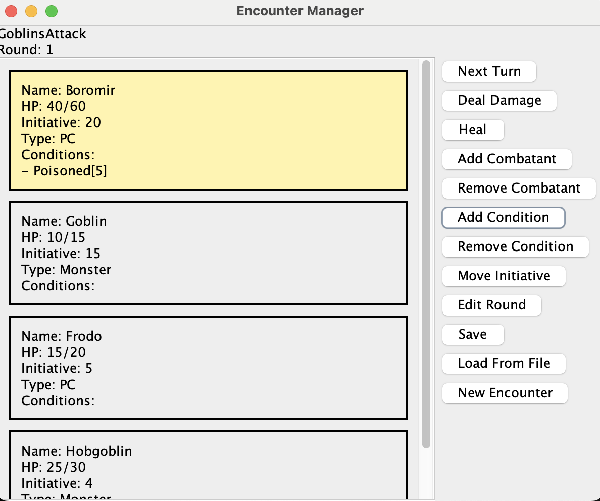

# Encounter Builder

A Java Swing application for managing tabletop RPG combat encounters. Allows for creation of custom encounters with editable, statistics for Name, HP, dynamic Initiative score, Type, and conditions. Features like add/remove for individual combatants, as well as save and load features to prebuild encounters. 

## Features

- Turn and round tracking
- Initiative sorting
- Add/remove combatants
- Damage and healing system
- Condition tracking
- Save/load encounters from files
- Scrollable combatant interface
- Current turn highlighting
## Saving and Loading

Encounters can be saved to and loaded from `.enc` files using the GUI buttons.

## Technologies Used

- Java
- Java Swing
- Object-Oriented Programming
- ArrayLists
- Custom Encounter ADT to managing intiative, combatants, and round progression
- Lambda expressions
- File serialization
- JUnit testing
- FlatLaf Java Swing Look and feel

## How to Run/Install (MacOS)
You must first have a JDK installed with JPackage.

```bash
javac -cp "lib/flatlaf-3.7.2.jar" -d out src/*.java 
```
```bash
jar --create \
    --file EncounterBuilder.jar \
    --main-class Main \
    -C out .
```
```bash
jpackage \
  --input . \
  --dest dist \
  --name EncounterBuilder \
  --main-jar EncounterBuilder.jar \
  --main-class Main \
  --type dmg
```

## How to Run/Install (Windows)
You must first have a JDK installed with JPackage.

```bash
javac -cp "lib/*" -d out src/*.java 
```
```bash
jar --create ^
    --file EncounterBuilder.jar ^
    --main-class Main ^
    -C out .
```
```bash
jpackage ^
    --input dist ^
    --dest dist ^
    --name EncounterBuilder ^
    --main-jar EncounterBuilder.jar ^
    --main-class Main ^
    --type exe
```

## Testing

JUnit tests are included in `EncounterTest.java`.

Run tests with:

```bash
javac -g -cp "out:lib/junit.jar" -d out test/*.java

java -jar lib/junit.jar execute --class-path out --scan-class-path
```

## Documentation

Javadocs can be generated with:

```bash
javadoc -d docs src/*.java
```

To generate UML Class Diagram (MacOS):


```
brew install graphviz plantuml

(Navigate to /documentation within the repo)
plantuml Encounter.puml
```

## Screenshots
Sample loaded encounter with applied condition.


## Challenges
- Handling dynamic Swing layouts and scrolling to keep elements in frame
- Handling invalid input into GUI to prevent crashing
- Current turn tracking not wrapping 
- Removing from the index based turn tracker causing indices to change depending on what was removed

## Future Improvements
- Unique Icon to replace default swing icons
- Initiative drag-and-drop
- Monster templates
    - Backend database for saved combatants (JSON?)
- Better tile layouts
- Encounter export formats
- Combat log/history
- Undo system
- Search function


### Undo System
Potential stack-based history system for:
- HP changes
- removed combatants
- combat actions

### Save/Load Enhancements
- Multiple save files
- Save naming system
- Auto-save functionality

### Potential backend database
- Store parties and members 
- Creature database (For creation then saving and drag and drop use later)


## Author

Rowan Lynn